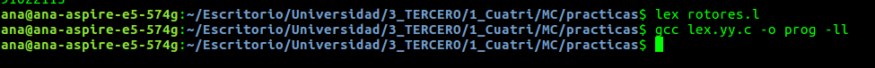
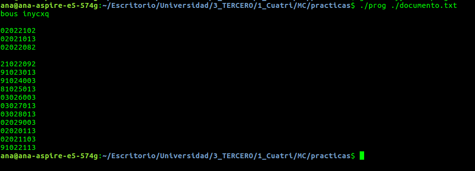
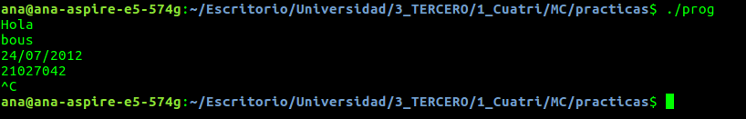

# Memoria de la práctica de Lex

> Mapachana

## Funcionalidad del programa

Para la práctica, he programado, mediante expresiones regulares una máquina de cifrado de mensajes, la cual encripta, usando una simplificación del método de la máquina Enigma el texto, y las fechas. Además, elimina los signos de puntuación básicos para dificultar el entendimiento del mensaje en caso de intentar descifrarlo.

## La máquina Enigma

La máquina Enigma permitía tanto cifrar como descifrar mensajes. Consta de varios rotores conectados entre sí. Cada rotor es un disco plano con 26 contactos, uno por letra del alfabeto. Cada contacto de un rotor está conectado a otro contacto del siguiente rotor, en la cara de contraria. Esto es, la salida de un rotor sirve de entrada al siguiente.

Cada rotor tiene una posición inicial, la cual es indispensable conocer para descifrar el mensaje. Cada vez que se introduce un carácter para su cifrado en la máquina, la posición de los rotores varía, fortaleciendo así el método de cifrado.

Por cada carácter introducido el primer rotor rota una posición. Una vez el primer rotor ha completado una vuelta(ha rotado 26 veces), el segundo rotor varía su posición. Y, análogamente, una vez el segundo rotor ha completado una vuelta, el tercer rotor se desplaza un lugar.

En concreto, la máquina de rotores que se ha realizado, consta de tres rotores, con misma posición inicial, por simplicidad.

## Explicación del código

El código consta de varios subproblemas,  corresponden a una o más expresiones regulares:

- **Cifrado del texto**: La expresión regular coge todas las letras de la _a_ a la _z_, independientemente de si son mayúsculas o minúsculas y las cifra mediante la máquina de rotores.

```c
[A-Z a-z]   {  
          char letra = yytext[0];
          letra = tolower(letra);
          int num_letra = letra-'a';
          for (int i = 0; i < num_rotores; ++i){
            num_letra = rotores[i][num_letra+num_giros[i]]-'a';
          }
          num_giros[0]++;
          if (num_giros[0] == 26){
            num_giros[1]++;
            num_giros[0] = 0;
            if (num_giros[1] == 26){
              num_giros[2]++;
              num_giros[1] = 0;
              if (num_giros[2] == 26){
                num_giros[2] = 0;
              }
            }
          }
          letra = (char) (num_letra+(int)'a');
          printf("%c", letra);  
        }

```

- **Cifrado de la fecha**: El programa detecta si hay una fecha válida, entendiendo por fecha válida un día posible para el mes especificado con el año entre 1000 y 2999. Si la fecha es válida y está expresada en formato `dd/mm/yyyy` entonces la cifrará, resultando `yyyymmdd` en orden inverso, en caso contrario, la eliminará.

  Se han usado tres expresiones regulares, la primera recoge todas las posibles fechas correctas en años no bisiestos, la segunda acepta el 29/02 una vez se ha comprobado que el año es bisiesto, y la última elimina todas las fechas con el formato adecuado pero imposibles, y las elimina.

```c
(0[1-9]|[1-2][0-9]|[3][0-1])\/((0(1|3|5|7|8))|(10|12))\/([1-2][0-9][0-9][-0-9])|(0[1-9]|[1-2][0-9]|30)\/((0(4|6|9))|11)\/([1-2][0-9][0-9][0-9])|(0[1-9]|1[0-9]|2[0-8])\/02\/([1-2][0-9][0-9][0-9]) {
          valid=1;
          if (valid==1)
            codificar_fecha(yytext);
            valid = 0;
        } 
  
        
  
        29\/02\/([1-2][0-9][0-9][0-9])  {
          char anio[4];
          for (int i = 0; i < 4; ++i){
            anio[i] = yytext[6+i];
          } 
          yr = atoi(anio);
        if(yr%4==0||(yr%100==0&&yr%400!=0))
        valid=1;
        if (valid==1){
          codificar_fecha(yytext);
          valid = 0;
          }
        } 

        (19|20)\d\d[- /.](0[1-9]|1[012])[- /.](0[1-9]|[12][0-9]|3[01]) {
          int longitud = 10;
          char fecha[8];
          int contador = 0;
          for (int i = 0; i < longitud; ++i){
            char letra = yytext[i];
            if (letra != '/'){
              fecha[8-contador-1] = letra;
              contador++;
            }
          }
          printf("%s", fecha);

}

[0-9][0-9]\/[0-9][0-9]\/[0-9][0-9][0-9][0-9] {printf(" ");}

// función para codificar
void codificar_fecha (char f [10]){
  int longitud = 10;
  char fecha[8];
  int contador = 0;
  for (int i = 0; i < longitud; ++i){
    char letra = yytext[i];
    if (letra != '/'){
      fecha[8-contador-1] = letra;
      contador++;
    }
  }
  printf("%s", fecha);
}

```

- **Eliminación de . y ,**: Encuentra los puntos y comas y los sustituye por un espacio vacío, es decir, los elimina.

```c
\.|\,  {printf(" ");}
```

## Uso del programa

El programa se compila en línea de comandos como se muestra:



Admite como argumento un documento, e imprime por pantalla el cifrado, o bien se puede llamar sin argumentos y codificará la entrada que demos por teclado.

Un ejemplo del resultado de codificación usando el fichero de prueba que se adjunta es:



Un ejemplo de entrada por teclado es:



## Referencias

- [https://en.wikipedia.org/wiki/Enigma_machine](https://en.wikipedia.org/wiki/Enigma_machine)
- https://hipertextual.com/2011/07/la-maquina-enigma-el-sistema-de-cifrado-que-puso-en-jaque-a-europa
- https://cse.iitkgp.ac.in/~bivasm/notes/LexAndYaccTutorial.pdf
